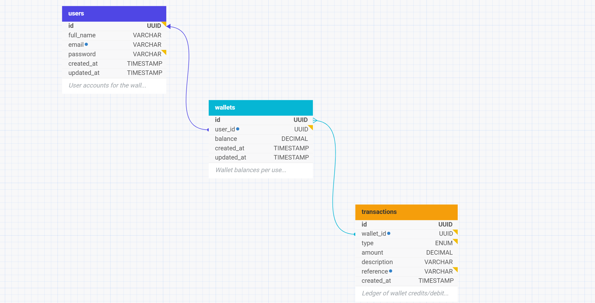

Table of Contents

Project Description
ER Diagram
Tech Stack
Design Decisions
Setup Instructions
API Endpoints

Project Description
Demo Credit is a wallet service that enables users to:

Register and log in securely
Fund their wallet
Transfer funds to other registered users
Withdraw funds from their wallet
View wallet balance and transaction history

Users flagged on the Lendsqr Adjutor Karma blacklist are automatically blocked from onboarding.

ER Diagram

Created with dbdesigner.net

Relationships

users → wallets: One-to-One (each user has exactly one wallet)
wallets → transactions: One-to-Many (a wallet can have many transactions)

## Tech Stack

| Technology | Purpose | Why |
|------------|---------|-----|
| Node.js | Runtime environment | Fast, non-blocking I/O ideal for financial APIs |
| TypeScript | Language | Type safety reduces runtime errors in financial logic |
| Express.js v5 | Web framework | Minimal, flexible, industry standard for REST APIs |
| MySQL | Database | ACID-compliant relational DB — critical for financial transactions |
| Knex.js | Query builder / ORM | Clean migrations, transaction support, SQL injection protection |
| bcryptjs | Password hashing | Industry standard for secure password storage |
| jsonwebtoken | Authentication | Stateless JWT auth — scalable and secure |
| Adjutor Karma API | Blacklist screening | Prevents onboarding of fraudsters and loan defaulters |
| Jest + Supertest | Testing | Reliable unit and integration testing |
| uuid | ID generation | Universally unique IDs for all records |

Design Decisions
1. UUID over Auto-increment IDs
UUIDs prevent ID enumeration attacks — a common security risk in financial systems where sequential IDs can expose user counts or allow guessing of resource IDs.
2. Karma Blacklist Check at Registration
The Adjutor Karma check is performed before any user record is created in the database. This ensures blacklisted users never enter the system at all, rather than being blocked after the fact.
3. Database Transactions for Financial Operations
All fund transfers use Knex database transactions (knex.transaction()), ensuring that debit and credit operations are atomic — either both succeed or both are rolled back. This prevents partial transfers.
4. Separation of Concerns
The project follows a layered architecture:

Routes → define endpoints
Controllers → handle HTTP request/response
Services → contain business logic
Models → interact with the database

This makes the codebase testable, maintainable, and easy to extend.
5. JWT Authentication
Stateless JWT tokens are used instead of sessions, making the API horizontally scalable without needing shared session storage.
6. One Wallet Per User
Each user is automatically assigned a single wallet upon registration. This simplifies the data model and matches the requirements of a basic wallet system.

Setup Instructions
Prerequisites

Node.js v18+
MySQL database
Adjutor API key (from app.adjutor.io)

Installation
bash# 1. Clone the repository
git clone https://github.com/your-username/demo-credit-wallet.git
cd demo-credit-wallet

# 2. Install dependencies
npm install

# 3. Copy environment file and fill in your values
cp .env.example .env
Environment Variables
Create a .env file in the root directory:
env# Server
PORT=3000
NODE_ENV=development

# Database
DB_HOST=localhost
DB_PORT=3306
DB_USER=root
DB_PASSWORD=your_password
DB_NAME=demo_credit

# Auth
JWT_SECRET=your_jwt_secret

# Adjutor Karma API
ADJUTOR_API_KEY=your_adjutor_api_key
ADJUTOR_BASE_URL=https://adjutor.lendsqr.com/v2
Database Setup
bash# Run migrations
npm run migrate

# Rollback if needed
npm run migrate:rollback
Running the App
bash# Development
npm run dev

# Production
npm run build
npm start
Running Tests
bashnpm test

API Endpoints
Base URL
http://localhost:3000/api/v1
Authentication
MethodEndpointAuth RequiredDescriptionPOST/auth/registerNoRegister a new userPOST/auth/loginNoLogin and receive JWT token
Wallet
MethodEndpointAuth RequiredDescriptionPOST/wallet/fundYesFund wallet with an amountPOST/wallet/transferYesTransfer funds to another userPOST/wallet/withdrawYesWithdraw funds from walletGET/wallet/balanceYesGet current wallet balance
Request & Response Examples
POST /auth/register
json// Request
{
  "full_name": "John Doe",
  "email": "john@example.com",
  "password": "securepassword"
}

// Response 201
{
  "message": "User registered successfully",
  "data": {
    "id": "uuid",
    "full_name": "John Doe",
    "email": "john@example.com"
  }
}
POST /auth/login
json// Request
{
  "email": "john@example.com",
  "password": "securepassword"
}

// Response 200
{
  "message": "Login successful",
  "token": "eyJhbGciOiJIUzI1NiIs..."
}
POST /wallet/fund
json// Request (Bearer token required)
{
  "amount": 5000
}

// Response 200
{
  "message": "Wallet funded successfully",
  "balance": 5000
}
POST /wallet/transfer
json// Request (Bearer token required)
{
  "recipient_email": "jane@example.com",
  "amount": 1000,
  "description": "Payment for services"
}

// Response 200
{
  "message": "Transfer successful",
  "balance": 4000
}
POST /wallet/withdraw
json// Request (Bearer token required)
{
  "amount": 2000
}

// Response 200
{
  "message": "Withdrawal successful",
  "balance": 2000
}
GET /wallet/balance
json// Response 200
{
  "balance": 2000
}

Error Responses
Status CodeMeaning400Bad request / validation error401Unauthorized — invalid or missing token403Forbidden — user is blacklisted404Resource not found409Conflict — e.g. email already exists500Internal server error

License
ISC